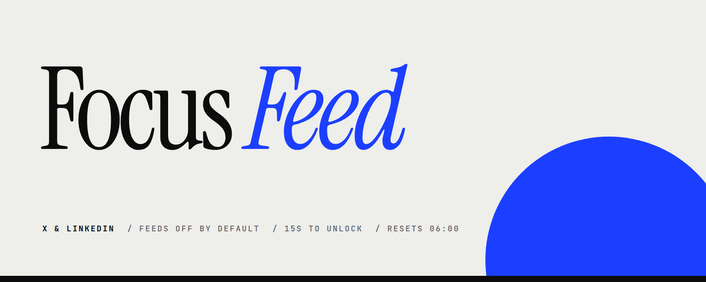
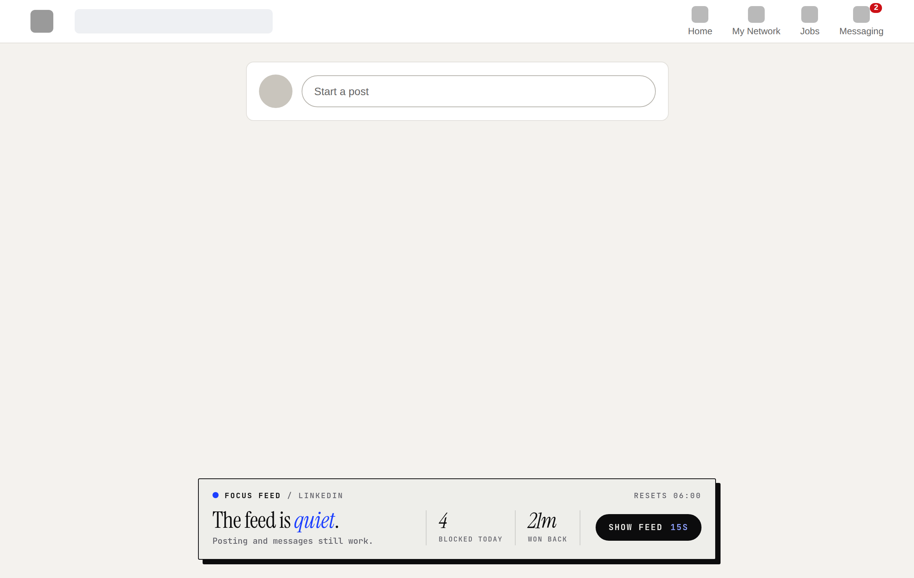
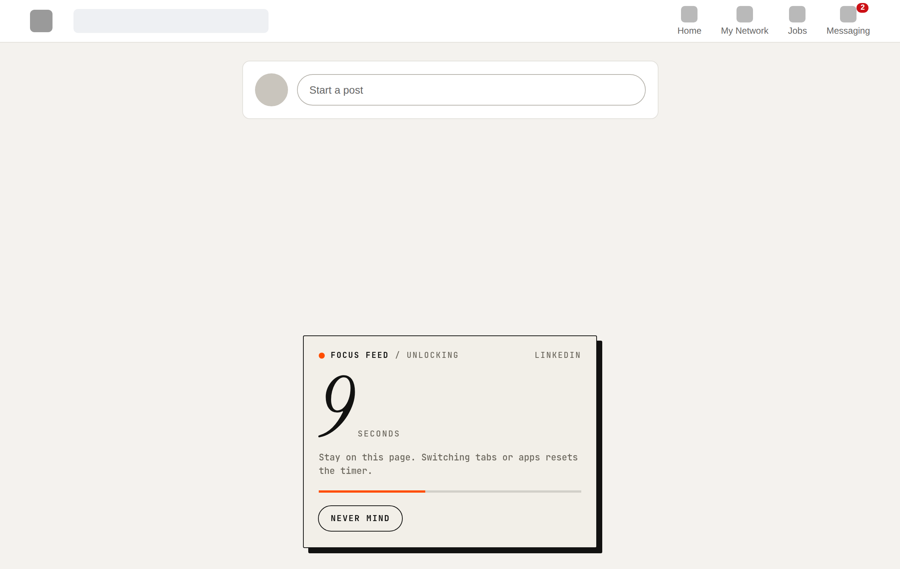
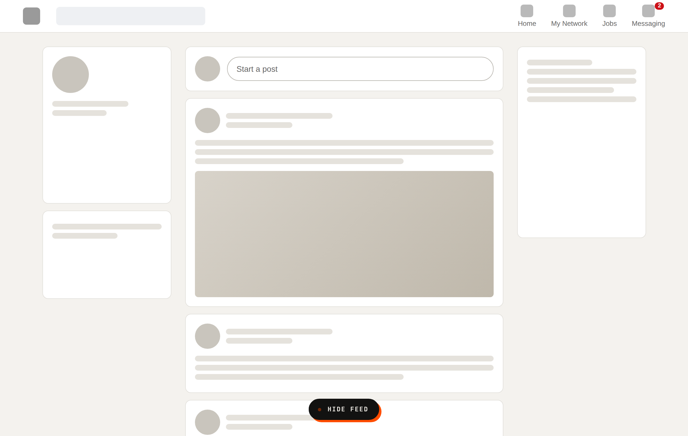
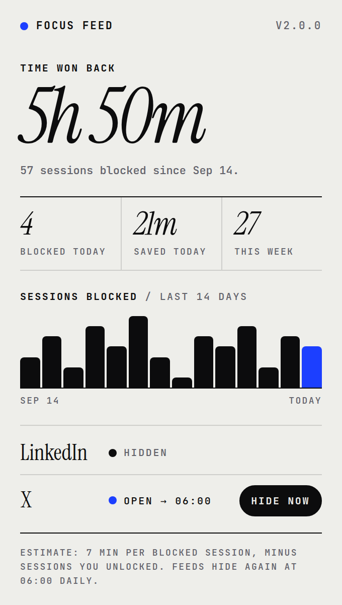
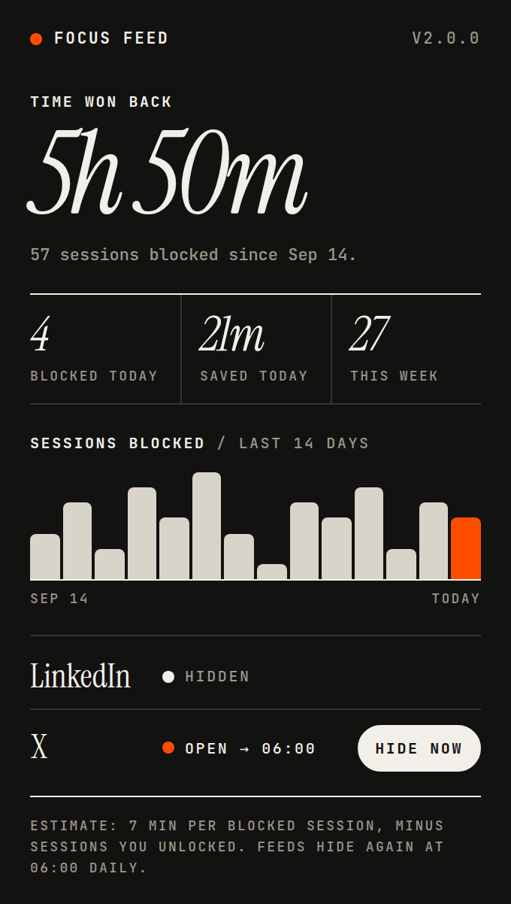

A browser extension that turns the X and LinkedIn feeds off by default. Messaging and posting keep working, and the notifications stay hidden. If you still want the feed, you have to wait for it.

## Install in 1 minute (Chrome, Arc, Brave, Edge)

1. **[Download Focus Feed](https://github.com/DominiquePaul/focus-feed/archive/refs/heads/main.zip)** and unzip it. Move the `focus-feed-main` folder somewhere you'll keep it, such as Documents, because the browser loads the extension from that folder.
2. Paste `chrome://extensions` into the address bar and turn on **Developer mode** (top right).
3. Drag the `focus-feed-main` folder onto that page. If dragging doesn't work, click **Load unpacked** and pick the folder instead.

That's it. Open LinkedIn or X and the feed is gone. Pin the icon in the toolbar to see your stats.

**Updating:** download again, replace the folder, then click the reload icon on the Focus Feed card in `chrome://extensions`. If you cloned with git, `git pull` and reload instead.

## How it works

- **Feeds off.** The feed is hidden on X (Home and Explore, plus the sidebar's trends, "What's happening" and "Live on X") and LinkedIn (home feed and both sidebars). The post composer stays, so you can still post.
- **Notifications off, messages on.** The bell, the red count badges and the `(3)` in the tab title are hidden. Messaging and its badge stay. Unlocking the feed brings the notifications back too, and **Hide feed** hides both again.
- **15 seconds to unlock.** Click **Show feed** and stay on the page. Switching tabs or apps resets the timer.
- **Stays unlocked until you stop it.** Once a feed is unlocked, it stays unlocked across reloads, tabs and restarts. Each site is unlocked separately.
- **One click to hide it again.** A floating **Hide feed** button sits on the unlocked feed.
- **Resets at 6 AM.** Every morning at 06:00, all feeds are hidden again.
- **Statistics.** Click the toolbar icon to see how many sessions were blocked and roughly how much time you got back.

<table>
  <tr>
    <td width="50%"></td>
    <td width="50%"></td>
  </tr>
  <tr>
    <td>Feed hidden. Posting still works.</td>
    <td>15 seconds of patience. Leaving the page resets the timer.</td>
  </tr>
  <tr>
    <td></td>
    <td>
      
      
    </td>
  </tr>
  <tr>
    <td>Unlocked until 06:00, or until you click <b>Hide feed</b>.</td>
    <td>The toolbar popup, in light and dark mode (demo data).</td>
  </tr>
</table>

The screenshots use a neutral mock page, not real feeds.

## How the numbers are counted

- **Session blocked:** a visit to a hidden feed. Visits less than 10 minutes apart count as one session, so reloading or clicking around doesn't inflate the count.
- **Time won back:** blocked sessions minus the ones you unlocked anyway, multiplied by 7 minutes. This is an estimate, not a measurement.

All data stays in `chrome.storage.local` on your machine. The extension makes no network requests.

## Configuration

These values are at the top of `shared.js`:

| Setting | Default | What it does |
|---|---|---|
| `UNLOCK_SECONDS` | `15` | How long you have to wait before the feed shows |
| `RESET_HOUR` | `6` | Local hour when unlocked feeds are hidden again |
| `SESSION_GAP_MS` | 10 min | Quiet time needed before a new blocked session is counted |
| `MINUTES_PER_SESSION` | `7` | Estimated minutes saved per blocked session |

## Files

| File | Purpose |
|---|---|
| `manifest.json` | Manifest V3. The only permission is `storage` |
| `shared.js` | Settings, storage helpers and the statistics maths |
| `focus.js` | Page detection, the unlock flow and the on-page card (in a shadow DOM) |
| `focus.css` | Hiding rules, injected at `document_start` so nothing flashes |
| `popup.*` | The toolbar popup with statistics and per-site controls |
| `fonts/` | Instrument Serif and JetBrains Mono (SIL Open Font License) |

## When a site changes its markup

X and LinkedIn change their pages often.

- **X:** the rules in `focus.css` use `data-testid` attributes, which rarely change.
- **LinkedIn:** class names are randomized, so `focus.js` finds the "Start a post" box by its text and hides everything around it. If it can't find the box, the whole column stays hidden and a **Write a post** button appears instead. If LinkedIn is in a language the extension doesn't recognize, add its wording to `COMPOSER_TEXT` in `focus.js`.

## License

MIT, see [LICENSE](LICENSE). The bundled fonts are under the SIL Open Font License (`fonts/OFL-*.txt`).
